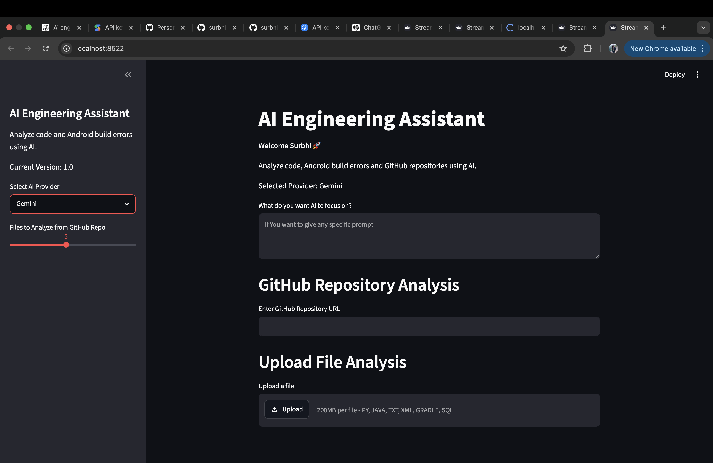
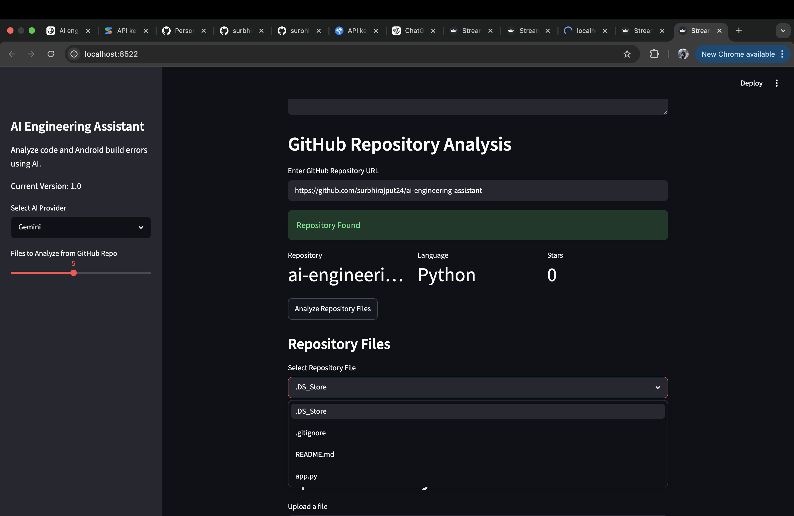
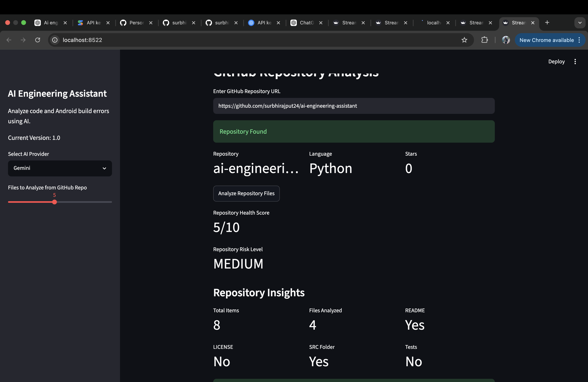
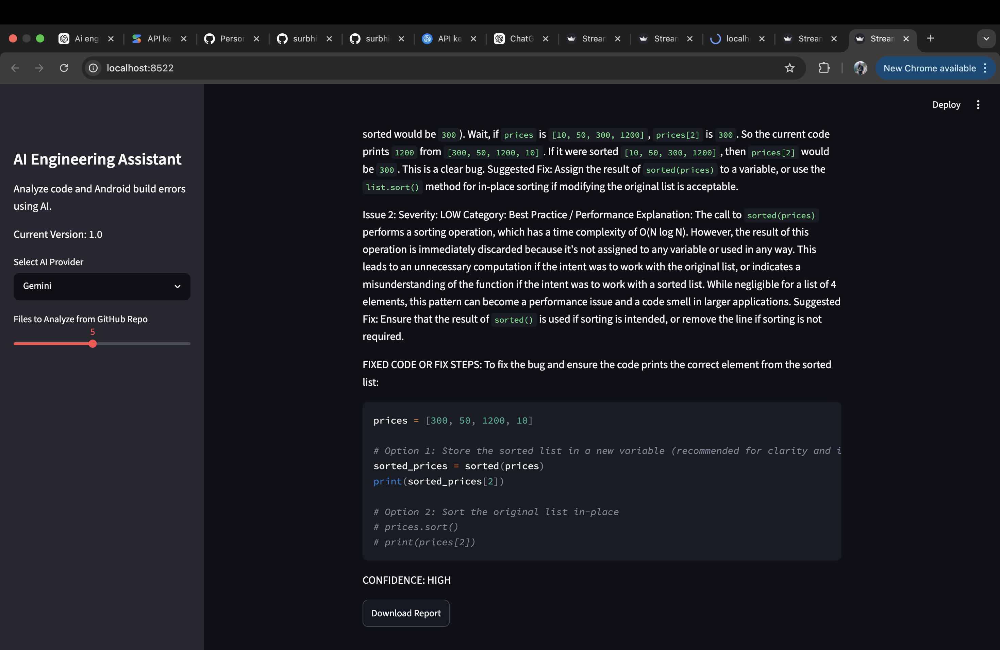

# AI Engineering Assistant

## Overview

AI Engineering Assistant is a Python and Streamlit based application that helps developers analyze source code, Android build errors, and GitHub repositories using Large Language Models (LLMs).

The application supports AI-powered code reviews, repository analysis, Android troubleshooting, repository health scoring, and downloadable reports.

---

## Features

### Local File Analysis

* Upload source code files
* Automatic file type detection
* AI-powered code review
* Download analysis reports

### GitHub Repository Analysis

* Analyze public GitHub repositories
* Browse repository files
* Analyze individual repository files
* Repository-wide analysis

### Repository Insights

* Repository Health Score
* Repository Risk Level
* Repository Insights Dashboard
* Downloadable repository reports

### Android Expert Mode

* Android build log analysis
* Android error classification
* Namespace error detection
* Manifest merger error detection
* Duplicate class detection
* Dependency resolution troubleshooting
* Android-specific fix recommendations

### Multi-LLM Architecture

* Gemini Integration
* OpenAI Integration
* Extensible architecture for additional providers

---


## Screenshots

### Dashboard



### GitHubRepository 



### GitHubRepository Analysis



### File Upload Analysis



## Architecture

```text
User
  ↓
Streamlit UI
  ↓
File Upload / GitHub API
  ↓
File Type Detection
  ↓
Prompt Builder
  ↓
LLM Factory
  ↓
Gemini / OpenAI
  ↓
Analysis Report
```

## Technology Stack

* Python
* Streamlit
* GitHub REST API
* Gemini API
* OpenAI API
* dotenv

---

## Project Structure

```text
ai-engineering-assistant/

├── src/
│   ├── ai_client.py
│   ├── openai_client.py
│   ├── github_client.py
│   ├── repository_analyzer.py
│   ├── build_error_classifier.py
│   ├── prompt_builder.py
│   ├── llm_factory.py
│
├── app.py
├── requirements.txt
├── README.md
└── .env
```

## Future Enhancements

* Claude Integration
* Repository Trend Analysis
* Security Scanning
* Pull Request Review
* Streamlit Cloud Deployment
* Authentication and User Profiles

## Author

Surbhi Rajput

AI Engineering Assistant - Portfolio Project
